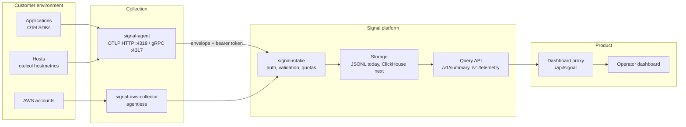

# Architecture

## Shape of the system

## Why OpenTelemetry, not a proprietary agent

Datadog built a large proprietary Agent; Dynatrace ships a curated
OpenTelemetry distribution alongside OneAgent. Both reuse far more of the
ecosystem than they replace. For a new platform, the distribution model is the
cheaper starting point: the receivers, protocol, and SDKs are commodity, while
tenant isolation, enrichment, routing, and the product surface are not.

Signal therefore speaks OTLP natively on both transports and treats anything
else as a migration path, not a destination.

## Trust boundaries

The most important rule in the system:

> **A tenant is whatever the presented credential says it is — never what the
> payload claims.**

The intake gateway resolves the tenant from the bearer token. An envelope may
carry a `tenant_id`, but if it disagrees with the authenticated tenant the
request is rejected. Stored events are attributed to the authenticated tenant.
Query endpoints derive the tenant the same way and pass it to the store, which
filters on it — so widening a query to another customer's data is not
expressible through the API.

The dashboard never holds the intake credential. The browser calls a
server-side proxy at `/api/signal`, which holds the token and forwards only the
read-only endpoints. This also keeps the request same-origin; the intake
service is not browser-facing and serves no CORS headers.

## Delivery guarantees

The collector queues events in memory, batches them, and retries delivery with
backoff. Three properties matter:

- **A bad event cannot stall good ones.** Payloads that are neither OTLP nor
  valid JSON are rejected at the edge with 400. If an unencodable event reaches
  the queue anyway, the batch is dropped and counted rather than retried
  forever.
- **A failing intake cannot exhaust memory.** The retained batch is bounded;
  overflow is dropped oldest-first and counted.
- **A restart does not silently lose data.** On SIGTERM the listeners close
  first, then the queue drains and flushes within a deadline.

Delivery is at-least-once and in-memory. Persistent edge buffering across a
process crash is not implemented.

## Storage

`Store` accepts writes; `QueryStore` adds tenant-scoped `Summary` and `Recent`.
The JSONL implementation appends durably and maintains a per-tenant in-memory
index — counters plus a bounded ring of recent events — rebuilt by one scan at
startup. Queries are served from that index, so dashboard polling does not
scale with retained volume.

This is a development store. The interface exists so ClickHouse (logs and
traces) and a Prometheus-compatible backend (metrics) can replace it without
touching the handlers. The tenant argument on every read is deliberately part
of the interface: it is the seam where isolation is enforced.

## AWS collection

The AWS collector is agentless and polls per region: CloudWatch metrics, EC2
inventory, ECS clusters and services, CloudTrail audit events, resource tags,
and per-service adapters. Sources are independent — one failing API returns
partial results with joined errors rather than discarding the cycle. CloudTrail
event IDs are deduplicated through a bounded, expiring map persisted atomically
between runs.

## Known gaps

- Storage is JSON Lines; ClickHouse and a metrics backend are the next step.
- No TLS on the listeners; deployments bind loopback and tunnel.
- No alert evaluation, service catalog, or fleet management yet.
- Tenant registry is a static file; no self-service onboarding or key rotation.
